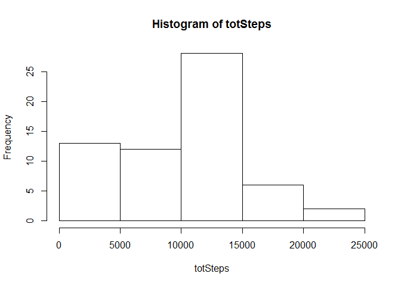
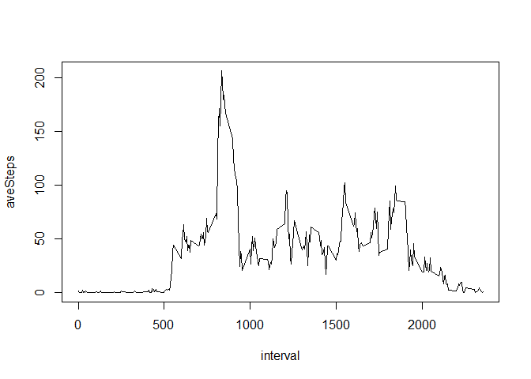
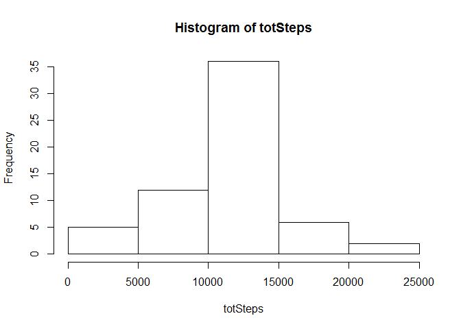
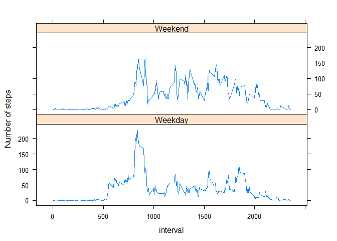

# Reproducible Research: Peer Assessment 1


## Loading and preprocessing the data
Start by loading in the csv file

```r
df <- read.csv("activity.csv")
```

Now I've manipulated to do daily calculations using the dplyr package

```r
require(dplyr)
```

```
## Loading required package: dplyr
## 
## Attaching package: 'dplyr'
## 
## The following objects are masked from 'package:stats':
## 
##     filter, lag
## 
## The following objects are masked from 'package:base':
## 
##     intersect, setdiff, setequal, union
```

```r
q1 <- df %>%
        group_by(date) %>%
        summarise(totSteps=sum(steps,na.rm=T))
```
This is the first few rows of the total number of steps per day

```r
head(q1)
```

```
## Source: local data frame [6 x 2]
## 
##         date totSteps
##       (fctr)    (int)
## 1 2012-10-01        0
## 2 2012-10-02      126
## 3 2012-10-03    11352
## 4 2012-10-04    12116
## 5 2012-10-05    13294
## 6 2012-10-06    15420
```


## What is mean total number of steps taken per day?
Here is a historgram of the total number steps taken each day

```r
with(q1,hist(totSteps))
```

 

The mean and median total number of steps taken each day is calculated as follows:

```r
mu <- mean(q1$totSteps)
med <- median(q1$totSteps)
```

The mean number of total steps in one day is 9354.2295082 and the median is 10395.


## What is the average daily activity pattern?
Using the originl dataset, the data needs to be grouped by 5 minute interval.

```r
q2 <- df %>%
        group_by(interval) %>%
        summarise(aveSteps=mean(steps,na.rm=T))
```

The output looks like this:

```r
head(q2)
```

```
## Source: local data frame [6 x 2]
## 
##   interval  aveSteps
##      (int)     (dbl)
## 1        0 1.7169811
## 2        5 0.3396226
## 3       10 0.1320755
## 4       15 0.1509434
## 5       20 0.0754717
## 6       25 2.0943396
```

Now to plot a time series:

```r
with(q2,plot(interval,aveSteps, type = "l"))
```

 

To calculate the interval with the highest average number of steps:

```r
maxAve <- q2[q2$aveSteps==max(q2$aveSteps),"interval"]
```

The interval with the highest average number of steps is 835.


## Inputing missing values
The following code calculates the total number of NAs

```r
totNAs <- sum(is.na(df$steps))
```

The total number of NAs are 2304.  

To avoid bias, I will replace all the NAs with the mean of the 5 minute interval over the whole dataset (eg, q2).  

To do this, I start by joining table q2 onto the main dataset and then create a new column which takes the average value if steps==NA:

```r
q3 <- merge(df,q2)
q3$newSteps = with(q3,ifelse(is.na(steps),aveSteps,steps))
```

Now to calculate the total number of steps for each day and create a histogram of this:

```r
q3.1 <- q3 %>%
        group_by(date) %>%
        summarise(totSteps=sum(newSteps))

with(q3.1,hist(totSteps))
```

 

The mean and median total number of steps taken each day is calculated as follows:

```r
mu3 <- mean(q3.1$totSteps)
med3 <- median(q3.1$totSteps)
```

The mean number of total steps in one day is 1.0766189\times 10^{4} and the median is 1.0766189\times 10^{4}. This has had the effect of increasing the mean and median.


## Are there differences in activity patterns between weekdays and weekends?
I start with creating a new factor variable onto the original dataset indicating whether the date is a weekday or a weekend:

```r
q4 <- q3 %>%
        mutate(dateConverted=as.Date(date),day=weekdays(dateConverted),dayClassification=factor(ifelse(day %in% c("Saturday","Sunday"),"Weekend","Weekday")))
```

I now group the data and plot it:

```r
q4 <- q4 %>%
        group_by(dayClassification,interval) %>%
        summarise(aveSteps=mean(newSteps))

require(lattice)
```

```
## Loading required package: lattice
```

```r
xyplot(aveSteps ~ interval  | dayClassification,data = q4, 
       layout = c(1,2),type = "l", ylab="Number of steps")
```

 
